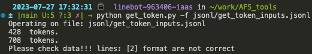
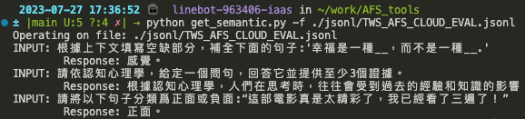

# AFS Toolkits

## Get Token Number

Use this tool to do token calcuation offline, usage:

```
python get_token.py -f ./jsonl/get_token_inputs.jsonl
```

and output will be like 




## Do Semantic Test

After you deploy a AFS Cloud, you can get service endpoint and API information, as well as paste those information to `get_semantic.py` you can run this command: 
```
python get_semantic.py -f ./jsonl/TWS_AFS_CLOUD_EVAL.jsonl 
```

and output will be like 



You can change to your dataset accordingly.


## Use Case

You can observe [use case](use_cases/) for service integration ideas.
