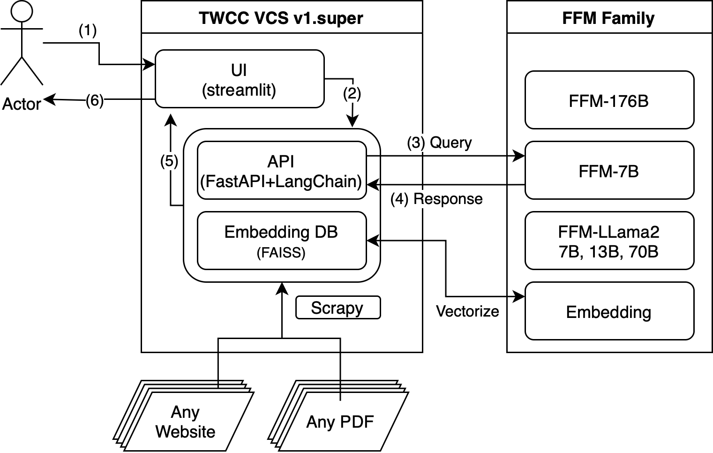

In this use case, web combines web crawling with Scrapy, data enhancement through FFM embeddings, and interactive user engagement using Streamlit and Langchain which integrated with FFM in [AFS Cloud](https://docs.twcc.ai/en/docs/user-guides/twcc/afs/afs-cloud). 

## Step by Step Deployment

> We have modified the code architecture to facilitate a more user-friendly deployment process.




### Step 1: Create GenAI or AFS Cloud service 

1. Register TWCC for free credits in https://tws.twcc.ai/freetrials/
2. Create LLM inference and Embedding Service by following [this](https://docs.twcc.ai/docs/user-guides/twcc/ccs-interactive-container/gai-container)

### Step 2: Update Parameters

1. Update the following parameters as needed:

```  
export AFS_CLOUD_EMBEDDING=https://5****.gai.twcc.ai
export API_KEY_EMBEDDING=f3364323-****-****-****-74d016dbc391
export AFS_CLOUD_FFM=https://5****.gai.twcc.ai
export API_KEY_FFM=55855a53-****-****-****-01d2a3e401c3
export FFM_MODEL_NAME=ffm-bloomz-7b
export CRAWL_DOMAINS='docs.twcc.ai'
export CRAWL_START_URL='https://docs.twcc.ai'
```

> remember to reload environment settings after you change values, by using `source .env`.

### Step 3: Prepare Docker Environment

1. Install docker `curl -fsSL get.docker.com | bash` and docker-compose `sudo curl -SL https://github.com/docker/compose/releases/download/v2.20.3/docker-compose-linux-x86_64 -o /usr/local/bin/docker-compose; sudo chmod a+x /usr/local/bin/docker-compose` in Ubuntu. (Checkout [docker-compose installation](https://docs.docker.com/compose/install/linux/) for more details)
2. Use command `sudo docker-compose up -d --build` to start container.
3. Use command `sudo docker-compose logs --tail=100 -f` to check the progress.
4. The time required for crawling and embedding webpages will vary, but it typically takes between 15 to 20 minutes, depending on the number of webpages involved.
5. Access your 80 port for chat interface. (Check your [security group](https://docs.twcc.ai/en/docs/user-guides/twcc/vcs/security-group/) setting in VCS)


## Technical Information

1. This directory is directly mounted to the container, ensuring that any modifications made are immediately reflected within the container.
2. All webpages crawled are stored in the `./generated/website.json` file and undergo vectorization, with the results saved in the `./generated/all_docs_embedding_website` directory.
3. Upon container initialization, both the `./generated/website.json` and `./generated/all_docs_embedding_website` files are backed up to the ./backup/ folder.
4. To rebuild the vector database, utilize the command `sudo docker exec -it webcrawler_chatbot-afs_demo-1 bash /commands/03.build_embedding.sh`. Notably, this process does not require restarting the UI and API services.
5. The initialization process is defined in `./docker/docker-entrypoint.sh`, and all corresponding commands can be located in the `/commands/` directory within the container.


